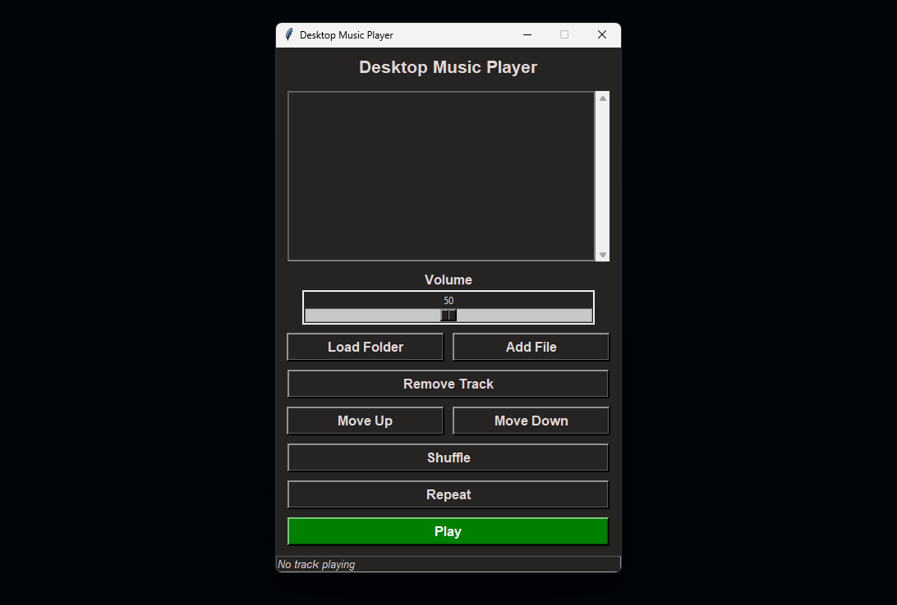

<h1 align="center">py-music-player</h1>

<p align="center">
  <a href="LICENSE">
    
  </a>
  <a href="https://github.com/anonymByte-404/py-music-player">
    
  </a>
  <a href="https://pypi.org/project/your-package-name/">
    
  </a>
  <a href="https://img.shields.io/badge/Python-3.11.9-blue.svg">
    
  </a>
  <a href="https://img.shields.io/badge/Pygame-2.6.1-blue.svg">
    
  </a>
  <a href="https://img.shields.io/badge/Tkinterdnd2-0.4.2-blue.svg">
    
  </a>
  <a href="https://img.shields.io/badge/Mutagen-1.47.0-blue.svg">
    
  </a>
</p>

<p align="center"><i>A simple desktop music player built with Python, Pygame, and Tkinter, designed to play MP3 files and manage playlists.</i></p>

>[!NOTE]
>This project is still in development. While the core features are functional, there is still plenty of room for improvement and expansion.

<h2 align="left">Features</h2>

<ul>
    <li>🎵 Play MP3 files</li>
    <li>📂 Load music files from a selected folder</li>
    <li>➕ Add individual MP3 files to the playlist</li>
    <li>⏯️ Toggle play/stop functionality for tracks</li>
    <li>🔁 Toggle repeat mode for the current track</li>
    <li>🔊 Adjust the volume through a slider</li>
    <li>🎶 Shuffle the playlist order</li>
    <li>⬆️ Move tracks up or down in the playlist</li>
    <li>💾 Playlist is saved and loaded automatically from a JSON file</li>
    <li>📥 Drag-and-drop support for loading MP3 files or folders</li>
    <li>🖥️ User-friendly GUI built with Tkinter</li>
</ul>

<h2 align="center">Installation</h2>

<p>To run the project, make sure you have Python 3.x installed and then follow these steps:</p>

1. Clone the repository:
    ```bash
    git clone https://github.com/yourusername/py-music-player.git
    ```

2. Navigate to the project directory:  
    ```bash
    cd py-music-player
    ```

3. Install required dependencies:
    ```bash
    pip install -r requirements.txt
    ```

4. Run the main script:
    ```bash
    python src/main.py
    ```

<h2 align="center">Usage</h2>

<p align="center">Below is a detailed preview of the Desktop Music Player interface, showcasing its clean and user-friendly design, as well as the essential controls and features available to users for a smooth music listening experience:</p>

<p align="center">
    
</p>

1. When the application starts, you can load MP3 files into the playlist using the "Load Folder" button or by adding individual MP3 files using the "Add File" button.
2. You can move tracks up and down in the playlist, remove selected tracks, or shuffle the playlist using the provided buttons.
3. The volume can be adjusted with the volume slider, and the play/stop button allows you to toggle playback of the currently selected track.
4. You can also toggle repeat mode to repeat the current track once it finishes.

<p>Feel free to contribute or open issues for bugs or feature requests!</p>

<h2 align="center">License</h2>

<p align="center">This project is licensed under the MIT License - see the <a href="LICENSE">LICENSE</a> file for details.</p>
